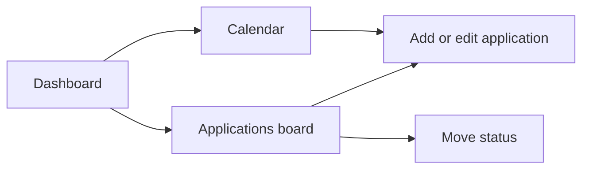

# Student Placement Tracker — Project Plan

## Purpose

Build a personal PERN application that keeps your placement applications, deadlines, and follow-up tasks organised in one place. The aim is a practical portfolio project that demonstrates CRUD, PostgreSQL design, REST APIs, and a responsive React interface.

## Version 1 goal

You can add an application, move it through its status, see what needs attention today, and review application deadlines and next actions in a calendar.

### User and scope

- **User:** you, as a single student managing your own placement search.
- **In scope:** applications, statuses, dates, notes, Kanban board, dashboard, calendar.
- **Out of scope:** sign-in, staff accounts, job scraping, automatic email notifications, document uploads, and university approval workflows.

## Suggested technology stack

| Layer | Choice | Why |
| --- | --- | --- |
| Frontend | React + Vite | Fast setup and reusable UI components. |
| Backend | Node.js + Express | Matches the Todo PERN project and is easy to explain in interviews. |
| Database | PostgreSQL | Demonstrates relational data and SQL skills. |
| Styling | CSS modules or plain CSS | Build your own clean interface before adding a component library. |
| Development tool | WebStorm | You have a licence and it provides great JavaScript, React, Git, and database support. |

## Core data model

Create one `applications` table.

| Field | Example | Notes |
| --- | --- | --- |
| `id` | `1` | Primary key. |
| `company` | `Canva` | Required. |
| `role` | `Software Engineering Intern` | Required. |
| `location` | `Sydney / Hybrid` | Optional. |
| `job_url` | `https://...` | Optional vacancy link. |
| `status` | `applied` | Required status value. |
| `deadline_date` | `2026-09-15` | Application deadline. |
| `applied_date` | `2026-09-01` | Date submitted. |
| `next_action_text` | `Prepare interview examples` | Clear next step. |
| `next_action_date` | `2026-09-08` | Reminder date. |
| `notes` | `Contacted recruiter…` | Optional notes. |
| `created_at`, `updated_at` | timestamps | Managed by PostgreSQL. |

Use these status values: `saved`, `applied`, `interview`, `offer`, `rejected`, `withdrawn`.

## Pages and user flow

### 1. Dashboard

- Top section: application count for Saved, Applied, Interview, and Offer.
- **Urgent reminders:** overdue deadlines or next actions for active applications.
- **Upcoming:** the next five deadlines or follow-ups.
- Clicking a reminder opens its application details.

### 2. Applications board

- Kanban columns: Saved, Applied, Interview, Offer, Rejected, Withdrawn.
- Each card shows company, role, location, and the nearest important date.
- Drag a card between columns or change the status in the edit form.
- Provide an **Add application** button.

### 3. Application details

- A side panel or dedicated page to edit every field.
- Required: company, role, status, and either a deadline or next-action date.
- Add validation for empty required fields, invalid links, and invalid dates.
- Include a delete action with a confirmation prompt.

### 4. Calendar

- Month view.
- Show two event types: application deadlines and next actions.
- Clicking an event opens the relevant application.
- Use clear labels as well as colour, so colour is not the only meaning.

## API plan

| Method | Endpoint | Purpose |
| --- | --- | --- |
| `GET` | `/applications` | List applications; later add `status` and `search` filters. |
| `POST` | `/applications` | Create an application. |
| `GET` | `/applications/:id` | Read one application. |
| `PATCH` | `/applications/:id` | Edit fields or move status. |
| `DELETE` | `/applications/:id` | Delete an application. |
| `GET` | `/calendar?month=YYYY-MM` | Return deadline and next-action events for one month. |

## Build order

1. Create the Git repository, React client, Express server, and PostgreSQL database.
2. Write the SQL schema and seed three example applications manually.
3. Implement and test the application CRUD API with Postman, Bruno, or WebStorm HTTP Client.
4. Build the Add/Edit Application form and applications list.
5. Convert the list into the Kanban board; add status changes first, drag-and-drop second.
6. Add the dashboard reminders and summary counts.
7. Add the calendar endpoint and month view.
8. Improve responsive layout, validation, empty states, and the README.
9. Deploy later, after version one is reliable.

## Definition of done for version 1

- You can create, edit, delete, and filter applications.
- Board status changes update the application immediately.
- The dashboard correctly highlights overdue and upcoming active reminders.
- The calendar shows deadlines and next actions for its selected month.
- Data remains after refreshing because it is stored in PostgreSQL.
- The interface works on a phone-width screen and a laptop-width screen.
- The README explains setup, database configuration, screenshots, and the problem the app solves.

## Portfolio improvements for version 2

- Authentication and a per-user applications table.
- Browser or email reminder notifications.
- Resume and cover-letter document links.
- Application search, sorting, and analytics.
- Tests for API validation and main React user flows.
- Deployment with environment variables and a managed PostgreSQL database.
